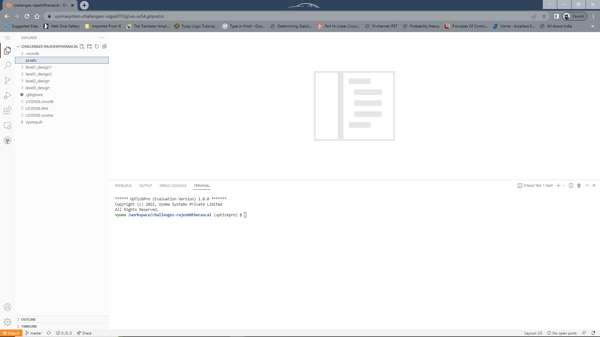
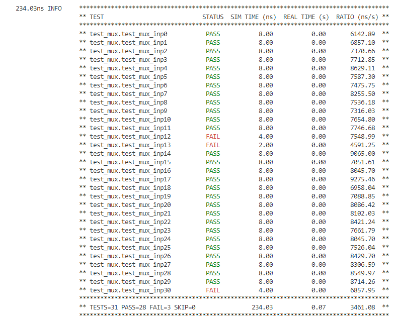
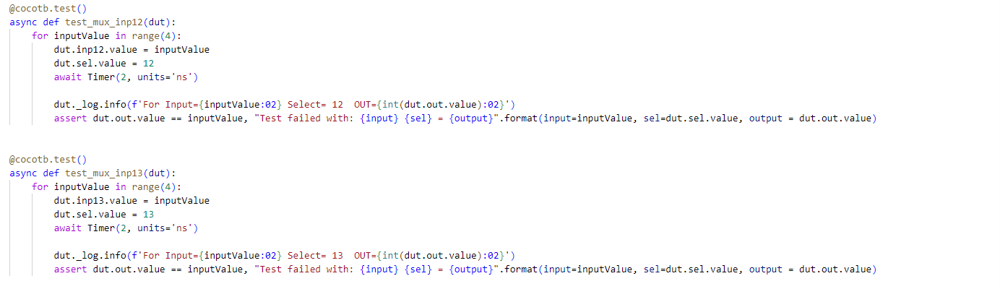

# Adder Design Verification

The verification environment is setup using [Vyoma's UpTickPro](https://vyomasystems.com) provided for the hackathon.



## Verification Environment

The [CoCoTb](https://www.cocotb.org/) based Python test is developed as explained. The test drives inputs to the Design Under Test Multiplexer which takes in 5-bit select input *sel* and channel inputs *inp0 : inp 30* gives 2-bit output *out*

The values are assigned to the input port using 
```
        dut.inp0.value = inputValue
        dut.sel.value = 0
```
for the test case *test_mux_inp0*

The assert statement is used for comparing the multiplexers's outut to the expected value.

The following error is seen:
```
assert dut.out.value == inputValue, "Test failed with: {input} {sel} = {output}".format(input=inputValue, sel=dut.sel.value, output = dut.out.value)

```
## Test Scenarios **(Important)**
A total of 31 test cases are build.

Each test cases simulates all possible inputs for a particular select channel i.e. 00,01,10 and 11

## Design Bug
Based on the above test input and analysing the design, we see the following



in lines 40 and 41, 2 case condtions are same. For *inp12* instead of *5'b01100*,  *5'b01101* is used. Because of this *inp13* is disconnected. 

```
      5'b01101: out = inp12;
      5'b01101: out = inp13;
```

Following test cases expose bugs for *inp12* and *inp13*

 

Also, case condition for *inp30* is not included in src.

## Design Fix
Updating the design in case statement is

```
  begin
    case(sel)
      5'b00000: out = inp0;  
      5'b00001: out = inp1;  
      5'b00010: out = inp2;  
      5'b00011: out = inp3;  
      5'b00100: out = inp4;  
      5'b00101: out = inp5;  
      5'b00110: out = inp6;  
      5'b00111: out = inp7;  
      5'b01000: out = inp8;  
      5'b01001: out = inp9;  
      5'b01010: out = inp10;
      5'b01011: out = inp11;
      5'b01100: out = inp12; #change 5'b01101 to 5'b01100
      5'b01101: out = inp13;
      5'b01110: out = inp14;
      5'b01111: out = inp15;
      5'b10000: out = inp16;
      5'b10001: out = inp17;
      5'b10010: out = inp18;
      5'b10011: out = inp19;
      5'b10100: out = inp20;
      5'b10101: out = inp21;
      5'b10110: out = inp22;
      5'b10111: out = inp23;
      5'b11000: out = inp24;
      5'b11001: out = inp25;
      5'b11010: out = inp26;
      5'b11011: out = inp27;
      5'b11100: out = inp28;
      5'b11101: out = inp29;
      5'b11110: out = inp30;  # Add this line
      default: out = 0;
    endcase
  end

```

## Verification Strategy

To exercise all *sel* inputs and drive all possible inputs on selected inputs.

## Is the verification complete ?

Yes, it is complete as far as bugs are concerned. But all possible input conditions are not exercised

