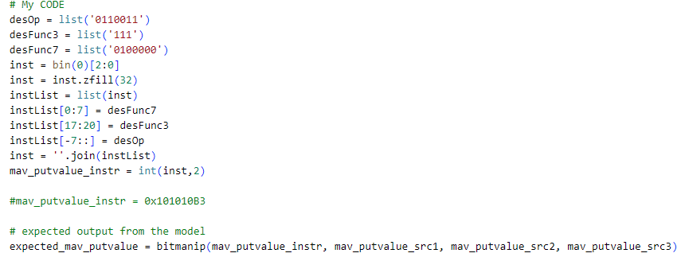
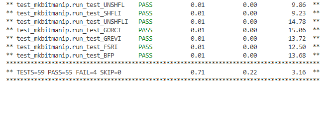

# Bit Manipulator Verification

The verification environment is setup using [Vyoma's UpTickPro](https://vyomasystems.com) provided for the hackathon.

Gitpod ID is shown in below image


## Verification Environment

The test drives inputs to the Design Under Test namely *mav_putvalue_instr*, *mav_putvalue_src1*, *mav_putvalue_src2*, *mav_putvalue_src3* and generates output *mav_putvalue*

Inputs are assigned as follows 

```
    mav_putvalue_src1 = 0x45
    mav_putvalue_src2 = 0x36
    mav_putvalue_src3 = 0x0
```
The following lines are used to drive inputs

```
    dut.mav_putvalue_src1.value = mav_putvalue_src1
    dut.mav_putvalue_src2.value = mav_putvalue_src2
    dut.mav_putvalue_src3.value = mav_putvalue_src3
    dut.EN_mav_putvalue.value = 1
    dut.mav_putvalue_instr.value = mav_putvalue_instr
```
Here, *inputs* is hexadecimal inputs. 

Challenge here is to construct instuction register according to the instruction under test.

Instruction is constructed using below code

This is example test case for testing ROR instruction.

```
    desOp = list('0110011')
    desFunc3 = list('101')
    desFunc7 = list('0110000')
    inst = bin(0)[2:0]
    inst = inst.zfill(32)
    instList = list(inst)
    instList[0:7] = desFunc7
    instList[17:20] = desFunc3
    instList[-7::] = desOp
    inst = ''.join(instList)
    mav_putvalue_instr = int(inst,2)
```

Instruction Generations 



## Test Scenarios **(Important)**

59 test cases are exercised for testing 58 instructions. Instructions are created as mentioned in previous section. Output after running alls testcases is shown in below images





## Design Bug

Following instructions are generating buggy outputs.

- ANDN
- SLO
- SRO
- CLZ

Unable to fix bugs as actual source is written in Bluespec System Verilog and converted to Verilog. 

## Verification Strategy

To exercise all possible instructions using brute force and identify instructions causing errors.

## Is the verification complete ?

Yes, it is complete as far as bugs are concerned. But all possible input conditions are not exercised.

