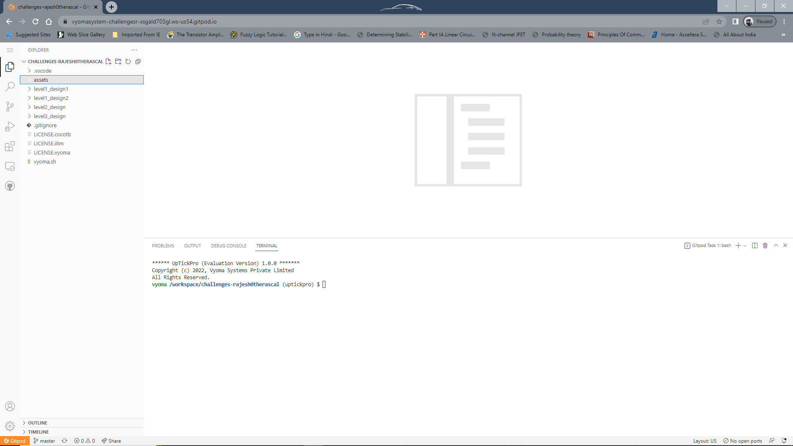
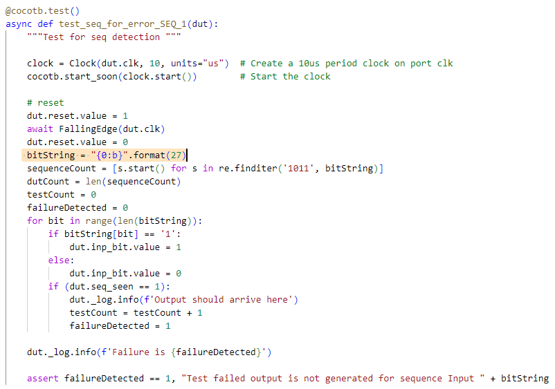

# Bit Manipulator Verification

The verification environment is setup using [Vyoma's UpTickPro](https://vyomasystems.com) provided for the hackathon.

Gitpod ID is shown in below image



## Verification Environment

The test drives inputs to the Design Under Test namely *mav_putvalue_instr*, *mav_putvalue_src1*, *mav_putvalue_src2*, *mav_putvalue_src3* and generates output *mav_putvalue*

Inputs are assigned as follows 

```
    mav_putvalue_src1 = 0x45
    mav_putvalue_src2 = 0x36
    mav_putvalue_src3 = 0x0
```
The following lines are used to drive inputs

```
    dut.mav_putvalue_src1.value = mav_putvalue_src1
    dut.mav_putvalue_src2.value = mav_putvalue_src2
    dut.mav_putvalue_src3.value = mav_putvalue_src3
    dut.EN_mav_putvalue.value = 1
    dut.mav_putvalue_instr.value = mav_putvalue_instr
```
Here, *inputs* is hexadecimal inputs. 

Challenge here is to construct instuction register according to the instruction under test.

Instruction is constructed using below code

This is example test case for testing ROR instruction.
 
```
    desOp = list('0110011')
    desFunc3 = list('101')
    desFunc7 = list('0110000')
    inst = bin(0)[2:0]
    inst = inst.zfill(32)
    instList = list(inst)
    instList[0:7] = desFunc7
    instList[17:20] = desFunc3
    instList[-7::] = desOp
    inst = ''.join(instList)
    mav_putvalue_instr = int(inst,2)
```

## Test Scenarios **(Important)**

4 Test cases are devised namely,
- test_seq_op_same_cycle to test *Output seq_seen should appear in next clock cycle*
- test_seq_all_bruteforc to test *All possible sequences which are 4 bit long to 8 bit long for single overlap with non sequence* to find all sequences that are not generating erroneous output
- test_seq_for_error_SEQ_1 *Using error sequences in test case 2 expose bugs in SEQ_1 state*
- test_seq_for_error_SEQ_101 *Using error sequences in test case 2 expose bugs in SEQ_101 state*

Following test cases are failed in the design


## Design Bug

### Test Case 1

Based on the above test input and analysing the design, we see the following

- Output is generated in same cycle when input goes high for last bit in sequence


Reason: output *seq_seen* is not synchronous with clock *clk*

### Test Case 2

Expose all sequences that are failing using all possible inputs


### Test Case 3

It is evident from above sequence that, valid sequences preceded by odd number of *1's* are causing error. This due to the bug in *SEQ_1* state



#### Buggy code 1

```
      SEQ_1:
      begin
        if(inp_bit == 1)
          next_state = IDLE;  // Bug is here
        else
          next_state = SEQ_10;
      end
```

Similarly Test case 4 exposes bug in the state *SEQ_101*

Valid sequences preceded by *10* will fail due to the following bug

#### Buggy code 2

```
      SEQ_101:
      begin
        if(inp_bit == 1)
          next_state = SEQ_1011;
        else
          next_state = IDLE; // Bug is here
      end
```

## Design Fix
Updating the design in case statement as follows will clear the code

#### Corrected code 1

```
      SEQ_1:
      begin
        if(inp_bit == 1)
          next_state = SEQ_1;  // Bug is here
        else
          next_state = SEQ_10;
      end
```

#### Corrected code 2

```
      SEQ_101:
      begin
        if(inp_bit == 1)
          next_state = SEQ_1011;
        else
          next_state = SEQ_10; // Bug is here
      end
```

## Verification Strategy

To exercise all possible conditions using brute force and identify sequences causing errors. Then expose bugs using directed test cases.

## Is the verification complete ?

Yes, it is complete as far as bugs are concerned. But possible input conditions are limited to 8 bit.

