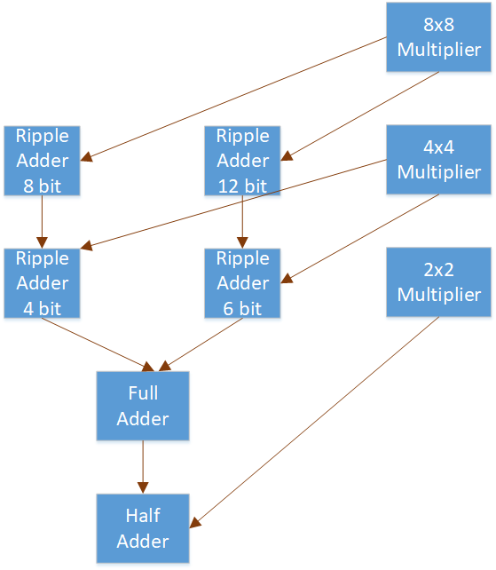
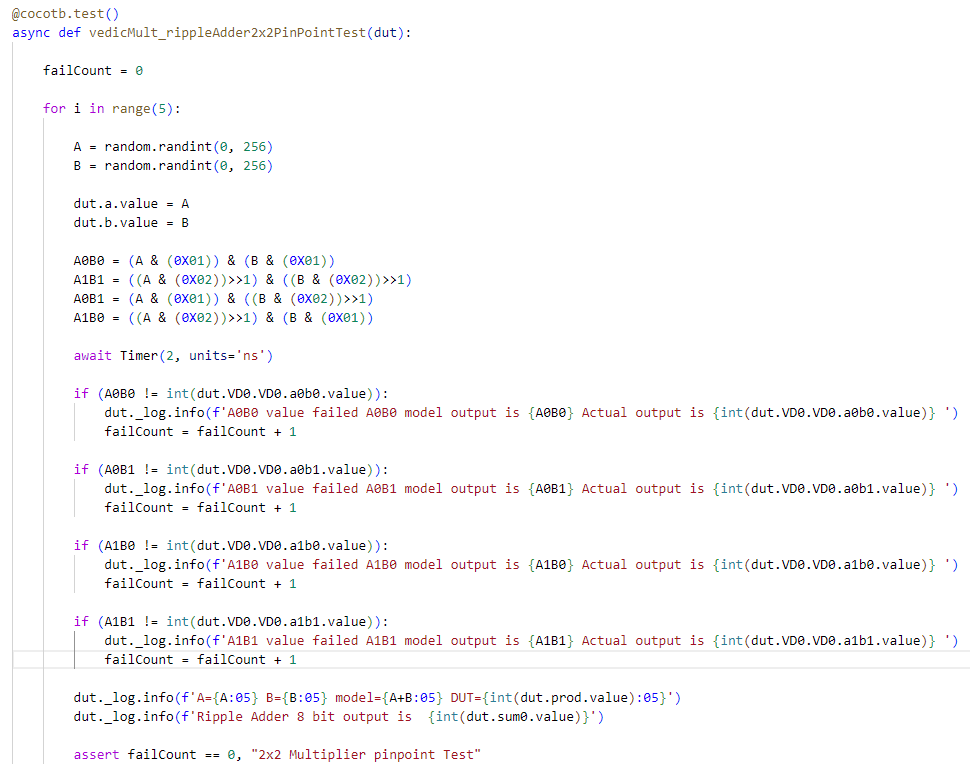

# Vedic Multiplier Verification

The verification environment is setup using [Vyoma's UpTickPro](https://vyomasystems.com) provided for the hackathon.

Gitpod ID is shown in below image


## Verification Environment

The test drives inputs to the Design Under Test 8 bit inputs *a* and *b* and generates 16 bit output *prod*.

The inputs are assigned as follows.
```
    A = 5
    B = 10
```
The inputs are designed as follows

```
    dut.a.value = A
    dut.b.value = B
```
Here, inputs are integer.

Design consists of following modules arranged in structural heirarchy

- Half Adder *half_adder.v*
- Full Adder *full_adder.v*
- 4 bit ripple adder *ripple_adder_4bit.v*
- 8 bit ripple adder *ripple_adder_8bit.v*
- 6 bit ripple adder *ripple_adder_6bit.v*
- 12 bit ripple adder *ripple_adder_12bit.v*
- 2x2 vedic multiplier *vedic2x2.v*
- 4x4 vedic multiplier *vedic4x4.v*
- 8x8 vedic multiplier *vedic8x8.v*

The structural heirarchy is shown below



## Test Scenarios **(Important)**

Test scenarios are constructed using top down methodology. Following test cases are constructed

- VedicMult basic test
- VedicMult randomised test
- Ripple adder test 8 bit
- Ripple adder test 12 bit
- Vedic mult 4x4 test
- Vedic mult 2x2 test
- Pinpoint test

Following test cases are run heirarchially to identify bug.

Test Case 1 and 2 are basic tests to check for failure.

Test Cases 3, 4 and 5 exercise randomised inputs for exposing errors in modules present in next level viz. Ripple adder 8 bit, Ripple adder 12 bit and Vedic Mult 4x4.

Test Cases 6 exercise randomised inputs for exposing errors in modules in Vedic Mult2x2.

Test Cases 7 exercise randomised inputs for pinpointing errors in Vedic Mult2x2.


## Design Bug

### Test Case 1

Basic test to check multiplication operation.

Status : *Failed*

### Test Case 2

Randomised tests to check multiplication operation

Status : *Failed*


### Test Case 3

Randomised tests to check functionality of 8 bit ripple adder.

Status : *Passed*


### Test Case 4

Randomised tests to check functionality of 12 bit ripple adder.

Status : *Passed*


### Test Case 5

Randomised tests to check functionality of 4x4 vedic multiplier.

Status : *Failed*


### Test Case 6

Randomised tests to check functionality of 2x2 vedic multiplier.

Status : *Failed*

### Test Case 7

Randomised tests to check pin point errors in 2x2 vedic multiplier.

Status : *Failed*

#### Buggy code 1

```
	wire a1b1 = a[1] | b[1];
	wire a0b1 = a[1] & b[0];
	wire a1b0 = a[0] & b[1];
```


## Design Fix


#### Corrected code 1

```
	wire a1b1 = a[1] & b[1];
	wire a0b1 = a[0] & b[1];
	wire a1b0 = a[1] & b[0];
```


## Verification Strategy

Test scenarios are constructed using top down methodology.

Design is divided into levels. 

- Level 1: 8x8 Vedic Multiplier
- Level 2: 4x4 Vedic Multiplier , 8 bit Ripple Adder, 12 bit Ripple adder
- Level 3: 2x2 Vedic Multiplier , 4 bit Ripple Adder, 6 bit Ripple adder
- Level 4: Half Adder, Full Adder

Test cases 1 and 2 confirm that an error is present in the design.

Test cases 3, 4, 5 are directed on modules in Level 2. Since 3 and 4 test cases are passed. It elimnates possibility of errors in depenedency modules viz. 4 bit Ripple adder, 6 bit Ripple adder, Full Adder and Half adder. Further test cases are not written to expose bugs in these modules as their functionality is safisfactory.

Test case 5 failure is attributed to 4x4 Vedic Multiplier. Since it is dependent on 2x2 Vedic Multiplier, Test case 6 directed on it for confirmation.

Test 7 is written to pin point the bug.




## Is the verification complete ?

Yes, it is complete as far as bugs are concerned. But possible input conditions are randomized and are only subset of all possible inputs.

