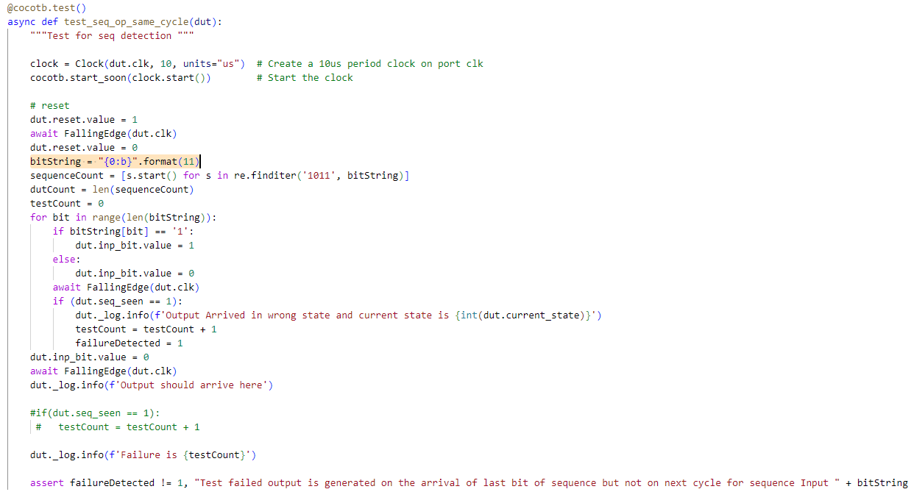
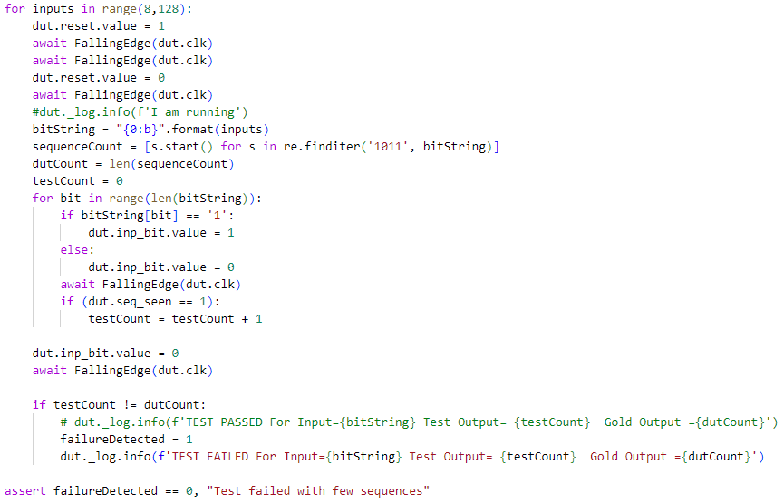
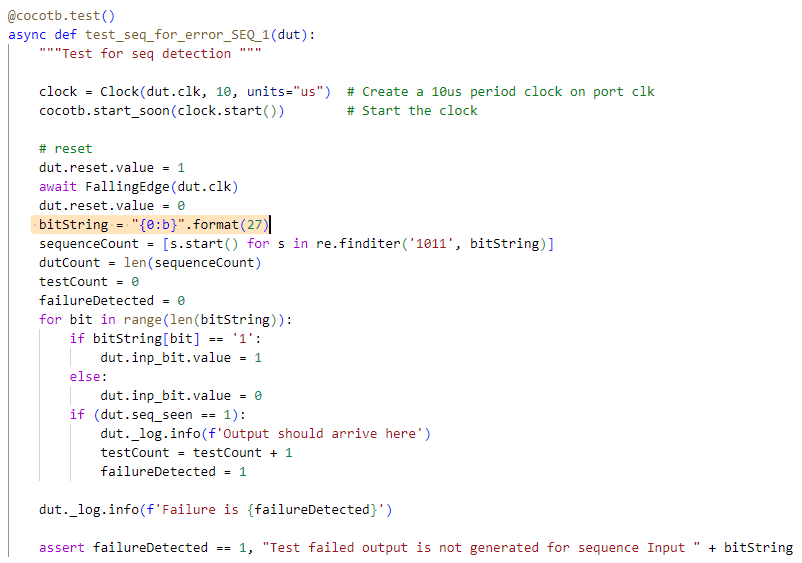

# Sequence Detector Verification

The verification environment is setup using [Vyoma's UpTickPro](https://vyomasystems.com) provided for the hackathon.

Gitpod ID is shown in below image


## Verification Environment

The test drives inputs to the Design Under Test 8 bit inputs *a* and *b* and generates 16 bit output *prod*.

The inputs are assigned as follows.
```
    A = 5
    B = 10
```
The inputs are designed as follows

```
    dut.a.value = A
    dut.b.value = B
```
Here, inputs are integer.

Design consists of following modules arranged in structural heirarchy

- Half Adder
- Full Adder
- 4 bit ripple adder
- 8 bit ripple adder
- 6 bit ripple adder
- 12 bit ripple adder
- 2x2 vedic multiplier
- 4x4 vedic multiplier
- 8x8 vedic multiplier

The structural heirarchy is shown below


## Test Scenarios **(Important)**

Test scenarios are constructed using top down methodology. Following test cases are constructed

- VedicMult basic test
- VedicMult randomised test
- Ripple adder test 8 bit
- Ripple adder test 12 bit
- Vedic mult 4x4 test
- Vedic mult 2x2 test
- Pinpoint test

Following test cases are run heirarchially to identify bug.


## Design Bug

### Test Case 1

Based on the above test input and analysing the design, we see the following

- Output is generated in same cycle when input goes high for last bit in sequence



Reason: output *seq_seen* is not synchronous with clock *clk*

### Test Case 2

Expose all sequences that are failing using all possible inputs




### Test Case 3

It is evident from above sequence that, valid sequences preceded by odd number of *1's* are causing error. This due to the bug in *SEQ_1* state



#### Buggy code 1

```
      SEQ_1:
      begin
        if(inp_bit == 1)
          next_state = IDLE;  // Bug is here
        else
          next_state = SEQ_10;
      end
```

Similarly Test case 4 exposes bug in the state *SEQ_101*

Valid sequences preceded by *10* will fail due to the following bug

#### Buggy code 2

```
      SEQ_101:
      begin
        if(inp_bit == 1)
          next_state = SEQ_1011;
        else
          next_state = IDLE; // Bug is here
      end
```

## Design Fix
Updating the design in case statement as follows will clear the code

#### Corrected code 1

```
      SEQ_1:
      begin
        if(inp_bit == 1)
          next_state = SEQ_1;  // Bug is here
        else
          next_state = SEQ_10;
      end
```

#### Corrected code 2

```
      SEQ_101:
      begin
        if(inp_bit == 1)
          next_state = SEQ_1011;
        else
          next_state = SEQ_10; // Bug is here
      end
```

## Verification Strategy

To exercise all possible conditions using brute force and identify sequences causing errors. Then expose bugs using directed test cases.

## Is the verification complete ?

Yes, it is complete as far as bugs are concerned. But possible input conditions are limited to 8 bit.

